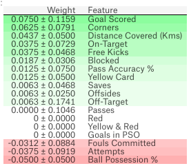
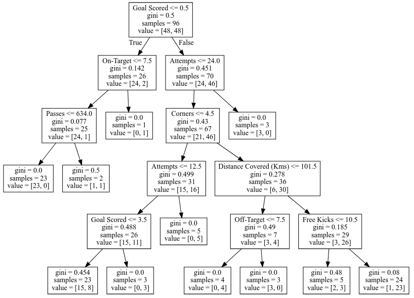
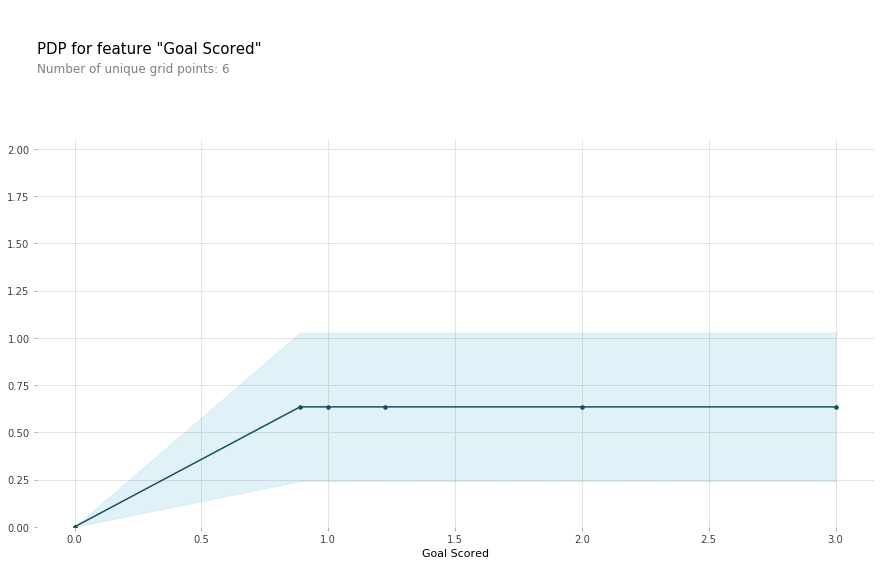
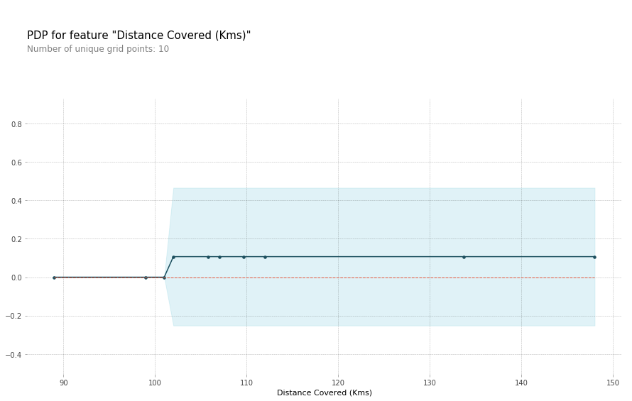
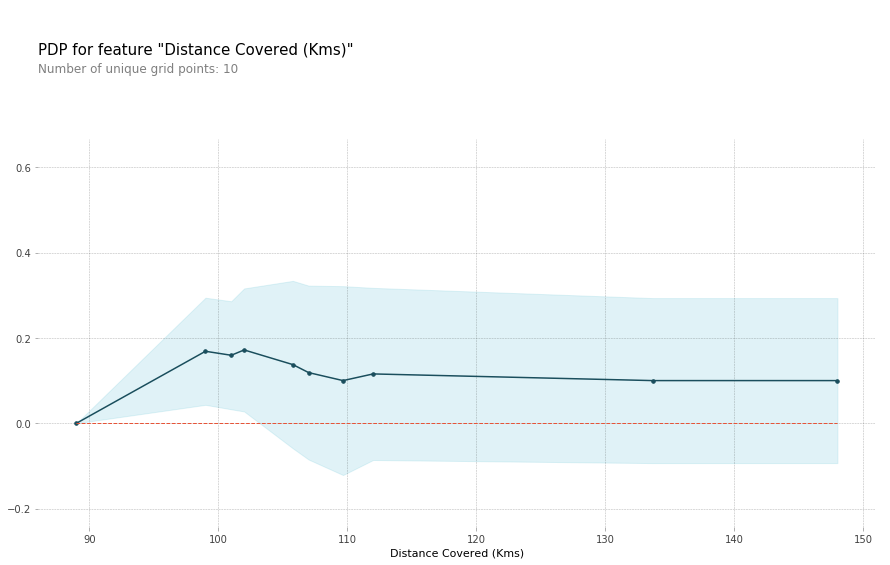
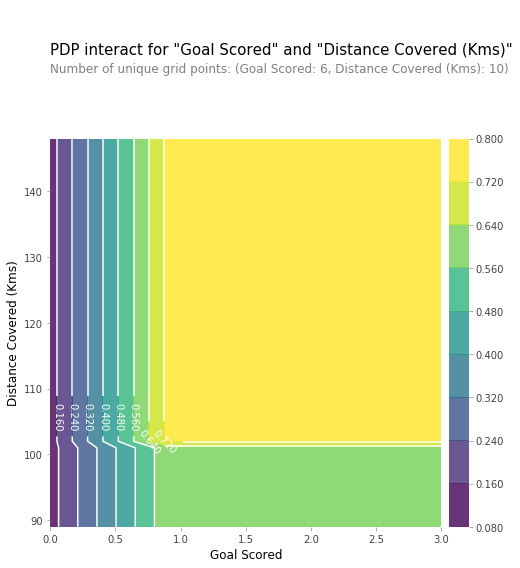
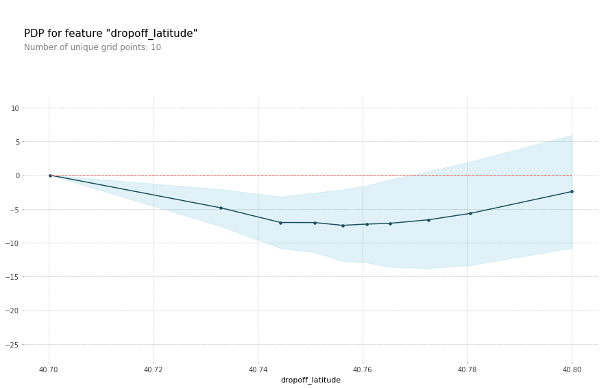
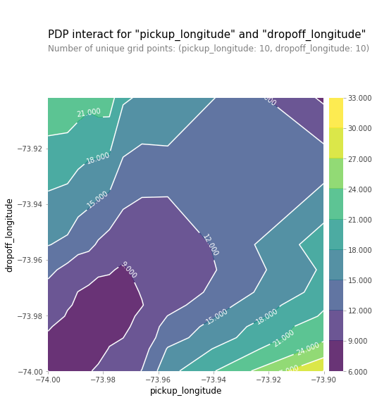

author:            Patrick Merlot
summary:           Machine Learning Model Explainability
id:                ML-explainability
categories:        education,best-practices,machine-learning,explainability
environments:      Codelabs
status:            draft
feedback link:     github.com/Patechoc/codelabs
analytics account: UA-72074624-2

# Machine Learning Model Explainability

## Overview of the tutorial
Duration: 2:00

This tutorial is just a summary/partial copy of what is provided in more details by Dan Becker on [Kaggle](https://www.kaggle.com/learn/machine-learning-explainability) to help me come back faster to the pieces I want to re-use.

Instead of going through these notes first, I would recommend going through the [original tutorials](https://www.kaggle.com/learn/machine-learning-explainability). There, pre-made _Kaggle kernels_ (~ Jupyter notebooks), not copied here, allow you to run the techniques you have just learned in [a fun way through Q&A](https://github.com/Kaggle/learntools). Highly recommended!


**No prerequesites**: Kaggle kernels runs perfectly in the browser.

-----------------------------------------------------------

Dan Becker, Head of _*Kaggle Learn*_ is [teaching us](https://www.kaggle.com/learn/machine-learning-explainability) how to extract insights from a Machine Learning (ML) model, sometimes considered as a "black box". 

Are most ML models really "black boxes"?

His short course aims at teaching us techniques to explain the findings from sophisticated machine learning models.

* What are the most important features of a model? (Permutation Importance)
* How a feature is affecting predictions? (Partial Dependence)
* How the model works for an individual prediction? (SHAP Values)
* How each feature affect/bias the model's predictions in a big-picture sense (what is its typical effect when considered over a large number of possible predictions?).


## Use Cases for Model Insights
Duration: 0:30


Why and when do you need insights in Machine Learning?

* Debugging models (add/remove features, tune hyperparameters)
* Building Trust (by providing information about the final model prediction)
* Informing feature engineering
* Informing human decision-making
* Directing future data collection (**not covered yet**)


## How to measure Feature Importance: Permutation Importance
Duration: 20:00

__Feature Importance__: What features have the biggest impact on predictions?

Compared to most other approaches, [Permutation Importance](https://www.kaggle.com/dansbecker/permutation-importance) is:

* Fast to calculate
* Widely used and understood
* Consistent with properties we would want a feature importance measure to have


### The process

1. Get a trained model
1. Shuffle the values in a single column, make predictions using the resulting dataset. Use these predictions and the true target values to calculate how much the loss function suffered from shuffling. That performance deterioration measures the importance of the variable you just shuffled.
1. Return the data to the original order (undoing the shuffle from step 2.) Now repeat step 2 with the next column in the dataset, until you have calculated the importance of each column.


### Code snippet

```python
import numpy as np
import pandas as pd
from sklearn.model_selection import train_test_split
from sklearn.ensemble import RandomForestClassifier

data = pd.read_csv('../input/fifa-2018-match-statistics/FIFA 2018 Statistics.csv')
y = (data['Man of the Match'] == "Yes")  # Convert from string "Yes"/"No" to binary
feature_names = [i for i in data.columns if data[i].dtype in [np.int64]]
X = data[feature_names]
train_X, val_X, train_y, val_y = train_test_split(X, y, random_state=1)
my_model = RandomForestClassifier(random_state=0).fit(train_X, train_y)


# Here is how to calculate and show importances with the eli5 library:
import eli5
from eli5.sklearn import PermutationImportance

perm = PermutationImportance(my_model, random_state=1).fit(val_X, val_y)
eli5.show_weights(perm, feature_names = val_X.columns.tolist())

```



### Exercise: Permutation Importance

[Link to the exercise.](https://www.kaggle.com/patechoc/exercise-permutation-importance/edit)

In this exercise, we learn:

* to reflect on the usefulness of each variable you have as a start beforetrying to  predict taxi fares in NYC.
* to **visualize the feature importance (feature's weights) of the first model** using **Permutation Importance** using [**Eli5**](https://eli5.readthedocs.io/en/latest/), a Python library which allows to visualize and debug various Machine Learning models using unified API. (e.g. latitude seems to have more importance than longitude)
* to help you formulate hypothesis based on the insight you got about your model. (e.g. unbalanced distance between longitude/latitude distances!?, different pricing for different part of NYC!? ...)
* to check some of these hypothesis by adding features that might disentangle hypothesis (e.g to disentangle the effect of being in certain parts of the city from the effect of the total distance traveled: create features for longitudinal & latitudinal distances).


## How a feature affects predictions: Partial Plots
Duration: 50:00

[Partial Dependence Plots](https://www.kaggle.com/dansbecker/partial-plots)

While **Feature Importance** shows **what variables** most affect predictions,

**Partial Dependence** plots show **how** a feature affects predictions.

This is useful to answer questions like:

* Controlling for all other house features, what impact do longitude and latitude have on home prices? To restate this, how would similarly sized houses be priced in different areas?
* Are predicted health differences between two groups due to differences in their diets, or due to some other factor?
* How quick NYC taxi prices are decreasing with distances?


### The process

1. Like permutation importance, partial dependence plots are calculated after a model has been fit. The model is fit on real data that has not been artificially manipulated in any way.
2. To see how partial plots separate out the effect of each feature, we start by considering a single row of data. (e.g. that row of data might represent a team that had the ball 50% of the time, made 100 passes, took 10 shots and scored 1 goal.)
3. We will use the fitted model to predict our outcome (e.g. here, the probability their player won "man of the game"), **but we repeatedly alter the value for one variable to make a series of predictions** (e.g. varying the fraction of the time the team had the ball).
4. We trace out predicted outcomes (on the vertical axis) as we move from small values to large values of that feature (on the horizontal axis).

In the description above, we used only a single row of data. Interactions between features may cause the plot for a single row to be atypical.

5. So, we repeat that mental experiment with multiple rows from the original dataset, and we plot the average predicted outcome on the vertical axis.


### Code snippet

Model building:

```python
import numpy as np
import pandas as pd
from sklearn.model_selection import train_test_split
from sklearn.ensemble import RandomForestClassifier
from sklearn.tree import DecisionTreeClassifier

data = pd.read_csv('../input/fifa-2018-match-statistics/FIFA 2018 Statistics.csv')
y = (data['Man of the Match'] == "Yes")  # Convert from string "Yes"/"No" to binary
feature_names = [i for i in data.columns if data[i].dtype in [np.int64]]
X = data[feature_names]
train_X, val_X, train_y, val_y = train_test_split(X, y, random_state=1)
tree_model = DecisionTreeClassifier(random_state=0, max_depth=5, min_samples_split=5).fit(train_X, train_y)
```

Representation of the Decision Tree used in this example:


```python
from sklearn import tree
import graphviz

tree_graph = tree.export_graphviz(tree_model, out_file=None, feature_names=feature_names)
graphviz.Source(tree_graph)
```



As guidance to read the tree:

* Leaves with children show their splitting criterion on the top
* The pair of values at the bottom show the count of True values and False values for the target respectively, of data points in that node of the tree.


Here is the code to create the Partial Dependence Plot using the [PDPBox library](https://pdpbox.readthedocs.io) (the Python **P**artial **D**ependence **P**lot tool**Box**).

```python
from matplotlib import pyplot as plt
from pdpbox import pdp, get_dataset, info_plots

# Create the data that we will plot
pdp_goals = pdp.pdp_isolate(model=tree_model, dataset=val_X, model_features=feature_names, feature='Goal Scored')

# plot it
pdp.pdp_plot(pdp_goals, 'Goal Scored')
plt.show()
```


A few items are worth pointing out as you interpret this plot:

* The __y-axis__ is interpreted as **change in the prediction** from what it would be predicted at the baseline or leftmost value.
* A blue shaded area indicates level of confidence.


From this particular graph, we see that scoring a goal substantially increases your chances of winning "Player of The Game." But extra goals beyond that appear to have little impact on predictions.


Here is another example plot:

```python
feature_to_plot = 'Distance Covered (Kms)'
pdp_dist = pdp.pdp_isolate(model=tree_model, dataset=val_X, model_features=feature_names, feature=feature_to_plot)

pdp.pdp_plot(pdp_dist, feature_to_plot)
plt.show()
```



This graph seems too simple to represent reality. But that's because the model is so simple. You should be able to see from the decision tree above that this is representing exactly the model's structure.

You can easily compare the structure or implications of different models. Here is the same plot with a Random Forest model.


```python
# Build Random Forest model
rf_model = RandomForestClassifier(random_state=0).fit(train_X, train_y)

pdp_dist = pdp.pdp_isolate(model=rf_model, dataset=val_X, model_features=feature_names, feature=feature_to_plot)

pdp.pdp_plot(pdp_dist, feature_to_plot)
plt.show()
```



This model thinks you are more likely to win "Player of The Game" if your players run a total of 100km over the course of the game. Though running much more causes lower predictions.

In general, the smooth shape of this curve seems more plausible than the step function from the simpler Decision Tree model. Though this dataset is small enough that we would be careful in how we interpret any model.


### 2D Partial Dependence Plots (comparing 2 features at once)

If you are curious about interactions between features, 2D partial dependence plots are also useful. An example may clarify what this.

We will again use the Decision Tree model for this graph. It will create an extremely simple plot, but you should be able to match what you see in the plot to the tree itself.


```python
# Similar to previous PDP plot except we use pdp_interact instead of pdp_isolate and pdp_interact_plot instead of pdp_isolate_plot
features_to_plot = ['Goal Scored', 'Distance Covered (Kms)']
inter1  =  pdp.pdp_interact(model=tree_model, dataset=val_X, model_features=feature_names, features=features_to_plot)

pdp.pdp_interact_plot(pdp_interact_out=inter1, feature_names=features_to_plot, plot_type='contour')
plt.show()
```



This graph shows predictions for any combination of Goals Scored and Distance covered.

For example, we see the highest predictions is obtained:

* when a team scores at least 1 goal, and they run a total distance close to 100km.
* If they score 0 goals, distance covered doesn't matter.
* distance can also impact predictions if they score goals. We can't see it from this simple Decision Tree, but we should see it when using Random Forest.

### Exercise: Partial Plots (vs Permutation Importance)

[Link to the exercise.](https://www.kaggle.com/patechoc/exercise-partial-plots/edit)

In this exercise, we learn to create partial dependence plots:

* on a real case (taxi fare in NYC)
* and on fictitious case that help compare PDP and Permutation Importance.




* We have a sense from the permutation importance results that distance is the most important determinant of taxi fare. This model didn't include distance measures (like absolute change in latitude or longitude) as features, so coordinate features (like pickup_longitude) capture the effect of distance. Being picked up near the center of the longitude values lowers predicted fares on average, because it means shorter trips (on average).
* For the same reason, we see the general U-shape in all our partial dependence plots.




* You should expect the plot to have contours running along a diagonal. We see that to some extent, though there are interesting caveats.
* We expect the diagonal contours because these are pairs of values where the pickup and dropoff longitudes are nearby, indicating shorter trips (controlling for other factors).
* As you get further from the central diagonal, we should expect prices to increase as the distances between the pickup and dropoff longitudes also increase.
* The surprising feature is that prices increase as you go further to the upper-right of this graph, even staying near that 45-degree line.
* This could be worth further investigation, though the effect of moving to the upper right of this graph is small compared to moving away from that 45-degree line.


-----------------------------------------------------------
## Understand individual predictions: SHAP Values
Duration: 40:00

You've seen (and used) techniques to extract general insights from a machine learning model (Permutation Importance, Partial Dependence Plots). **What if you want to break down how the model works for an individual prediction?**

**SHAP Values** (an acronym from **SHapley Additive exPlanations**) break down a prediction to show the impact of each feature on a trained model.


Where could you use this?

* A model says a bank shouldn't loan someone money, and the bank is legally required to explain the basis for each loan rejection
* A healthcare provider wants to identify what factors are driving each patient's risk of some disease so they can directly address those risk factors with targeted health interventions

[Use SHAP Values to explain individual predictions in this lesson](https://www.kaggle.com/dansbecker/shap-values). In the next lesson, you'll see how these can be aggregated into powerful model-level insights.

### The process

SHAP values interpret the impact of having a certain value for a given feature in comparison to the prediction we'd make if that feature took some baseline value.

In previous sections, we predicted whether a team would have a player win the "Man of the Game" award.

We could ask:

* How much was a prediction driven by the fact that the team scored 3 goals?

But it's easier to give a concrete, numeric answer if we restate this as:

* How much was a prediction driven by the fact that the team scored 3 goals, instead of some baseline number of goals?


Of course, each team has many features. So if we answer this question for number of goals, we could repeat the process for all other features.

SHAP values do this in a way that guarantees a nice property. When we make a prediction: 

`sum(SHAP values for all features) = pred_for_team - pred_for_baseline_values`

That is, the SHAP values of all features sum up to explain why my prediction was different from the baseline. This allows us to decompose a prediction in a graph like this:


How do you interpret this?

* We predicted 0.7, whereas the base_value is 0.4979.
* Feature values causing increased predictions are in pink, and their visual size shows the magnitude of the feature's effect.
* Feature values decreasing the prediction are in blue.
* The biggest impact comes from Goal Scored being 2. Though the ball possession value has a meaningful effect decreasing the prediction.
* If you subtract the length of the blue bars from the length of the pink bars, it equals the distance from the base value to the output.

There is some complexity to the technique, to ensure that the baseline plus the sum of individual effects adds up to the prediction (which isn't as straightforward as it sounds.) We won't go into that detail here, since it isn't critical for using the technique. [This blog post](https://towardsdatascience.com/one-feature-attribution-method-to-supposedly-rule-them-all-shapley-values-f3e04534983d) has a longer theoretical explanation.

### Code snippet

We calculate SHAP values using the wonderful [Shap](https://github.com/slundberg/shap) library.

For this example, we'll reuse the model you've already seen with the Soccer data.

```python
import numpy as np
import pandas as pd
from sklearn.model_selection import train_test_split
from sklearn.ensemble import RandomForestClassifier

data = pd.read_csv('../input/fifa-2018-match-statistics/FIFA 2018 Statistics.csv')
y = (data['Man of the Match'] == "Yes")  # Convert from string "Yes"/"No" to binary
feature_names = [i for i in data.columns if data[i].dtype in [np.int64, np.int64]]
X = data[feature_names]
train_X, val_X, train_y, val_y = train_test_split(X, y, random_state=1)
my_model = RandomForestClassifier(random_state=0).fit(train_X, train_y)
```

We will look at SHAP values for a single row of the dataset (we arbitrarily chose row 5). For context, we'll look at the raw predictions before looking at the SHAP values

```python
row_to_show = 5
data_for_prediction = val_X.iloc[row_to_show]  # use 1 row of data here. Could use multiple rows if desired
data_for_prediction_array = data_for_prediction.values.reshape(1, -1)

my_model.predict_proba(data_for_prediction_array)
# array([[0.3, 0.7]])
```

The team is 70% likely to have a player win the award.

Now, we'll move onto the code to get SHAP values for that single prediction.

```python
import shap  # package used to calculate Shap values

# Create object that can calculate shap values
explainer = shap.TreeExplainer(my_model)

# Calculate Shap values
shap_values = explainer.shap_values(data_for_prediction)
```

The shap_values object above is a list with two arrays:

* The first array is the SHAP values for a negative outcome (don't win the award),
* and the second array is the list of SHAP values for the positive outcome (wins the award). We typically think about predictions in terms of the prediction of a positive outcome, so we'll pull out Shap values for positive outcomes (pulling out shap_values[1].)

It's cumbersome to review raw arrays, but the shap package has a nice way to visualize the results.


```python
shap.initjs()
shap.force_plot(explainer.expected_value[1], shap_values[1], data_for_prediction)
```

which generates the image you have seen already:


If you look carefully at the code where we created the SHAP values, you'll notice we reference Trees in `shap.TreeExplainer(my_model)`. But the SHAP package has explainers for every type of model.

* `shap.DeepExplainer` works with Deep Learning models.
* `shap.KernelExplainer` works with all models, though it is slower than other Explainers and it offers an approximation rather than exact Shap values.


Here is an example using KernelExplainer to get similar results. The results aren't identical because kernelExplainer gives an approximate result. But the results tell the same story.

```python
# use Kernel SHAP to explain test set predictions
k_explainer = shap.KernelExplainer(my_model.predict_proba, train_X)
k_shap_values = k_explainer.shap_values(data_for_prediction)
shap.force_plot(k_explainer.expected_value[1], k_shap_values[1], data_for_prediction)
```

### Exercise: SHAP Values (from succint insights to more info per prediction)

[Link to the exercise.](https://www.kaggle.com/patechoc/exercise-shap-values/edit)

In this exercise, we learn:

* to apply all the techniques learned until now to get insights from a Machine Learning model on a concrete use case: _To identify patients with high risk of being readmitted, to avoid health complications_.
    * Measuring the performance of your model on validation data would be useful
        * https://machinelearningmastery.com/difference-test-validation-datasets/
        * https://www.analyticsvidhya.com/blog/2018/05/improve-model-performance-cross-validation-in-python-r/

    * Use Permutation Importance as a succint model summary

    * Use Partial Dependence Plot to show how the most important feature affects the model's predictions.
    * Use SHAP Values for One Prediction to create a visualization showing what feature with every minuscule impact on the readmission risk.

-----------------------------------------------------------
## Advanced Uses of SHAP Values
Duration: 50:00

Aggregate SHAP values for even more detailed model insights

- **What the model has learned?** is something **permutation importance** and **partial dependence plots** can give an overview of.
- then **break down the components of individual predictions** using **SHAP values**.
- Now let's try to **give more detailed alternatives to permutation importance and partial dependence plots**, by **aggregating many SHAP values**, some [advanced uses of SHAP Values](https://www.kaggle.com/dansbecker/advanced-uses-of-shap-values).

Recap: Shap values show how much a given feature changed our prediction (compared to if we made that prediction at some baseline value of that feature).

In addition to this nice breakdown for each prediction, the [Shap library](https://github.com/slundberg/shap) offers great visualizations of groups of Shap values. We will focus on two of these visualizations. These visualizations have conceptual similarities to permutation importance and partial dependence plots. So multiple threads from the previous exercises will come together here.


### SHAP Summary Plots

**SHAP summary plot** is a birds-eye view of feature importance and what is driving it.


This plot is made of many dots. Each dot has **three characteristics**:

- **Vertical location** shows **what feature it is depicting**
- **Color** shows whether that feature was **high or low for that row of the dataset**
- **Horizontal location** shows whether the effect of **that value caused a higher or lower prediction**.

For example, the point in the upper left was for a team that scored few goals, reducing the prediction by 0.25 from the baseline.

Some things you should be able to easily pick out:

* The model ignored the `Red` and `Yellow & Red` features.
* Usually _**Yellow Card**_ doesn't affect the prediction, but there is an extreme case where a high value caused a much lower prediction.
* High values of `Goal scored` caused higher predictions, and low values caused low predictions.

If you look for long enough, there's a lot of information in this graph. You'll face some questions to test how you read them in the exercise.


We get the SHAP values for all validation data with the following code. It is short enough that we explain it in the comments.

```python
import shap  # package used to calculate Shap values

# Create object that can calculate shap values
explainer = shap.TreeExplainer(my_model)

# calculate shap values. This is what we will plot.
# Calculate shap_values for all of val_X rather than a single row, to have more data for plot.
shap_values = explainer.shap_values(val_X)

# Make plot. Index of [1] is explained in text below.
shap.summary_plot(shap_values[1], val_X)
```

The code isn't too complex. But there are a few caveats.

* When plotting, we call `shap_values[1]`. For classification problems, there is a separate array of SHAP values for each possible outcome. In this case, we index in to get the SHAP values for the prediction of "True".
* Calculating SHAP values can be slow. It isn't a problem here, because this dataset is small. But you'll want to be careful when running these to plot with reasonable sized datasets. The exception is when using an `XGBOOST` model, which SHAP has some optimizations for and which is thus much faster.

This provides a great overview of the model, but we might want to delve into a single feature. That's where SHAP dependence contribution plots come into play.


### SHAP Dependence Contribution plots

**Partial Dependence Plots** help show how a single feature impacts predictions.

These are insightful and relevant for many real-world use cases. Plus, with a little effort, they can be explained to a non-technical audience.

But there's a lot they don't show. For instance, what is the distribution of effects? Is the effect of having a certain value pretty constant, or does it vary a lot depending on the values of other feaures.

**SHAP dependence contribution plots** provide a similar insight to PDP's, but they add a lot more detail.


Start by focusing on the shape, and we'll come back to color in a minute.

- **Each dot** represents **a row of the data**.
- The **horizontal location** is **the actual value from the dataset**,
- and the **vertical location** shows **what having that value did to the prediction**.


The fact this slopes upward says that the more you possess the ball, the higher the model's prediction is for winning the _Man of the Game_ award.

The spread suggests that other features must interact with `Ball Possession %`.


For example, here we have highlighted two points with similar ball possession values. That value caused one prediction to increase, and it caused the other prediction to decrease.


> For comparison, a simple linear regression would produce plots that are perfect lines, without this spread.

This suggests we delve into the interactions, and the plots include color coding to help do that. While the primary trend is upward, you can visually inspect whether that varies by dot color.

Consider the following very narrow example for concreteness.


- These two points stand out spatially as being far away from the upward trend.
- They are both colored purple, indicating the team scored one goal.
- You can interpret this to say:
> In general, having the ball increases a team's chance of having their player win the award. But if they only score one goal, that trend reverses and the award judges may penalize them for having the ball so much if they score that little.

Outside of those few outliers, the interaction indicated by color isn't very dramatic here. But sometimes it will jump out at you.

We get the dependence contribution plot with the following code. The only line that's different from the `summary_plot` is the last line.

```python
import shap  # package used to calculate Shap values

# Create object that can calculate shap values
explainer = shap.TreeExplainer(my_model)

# calculate shap values. This is what we will plot.
shap_values = explainer.shap_values(X)

# make plot.
shap.dependence_plot('Ball Possession %', shap_values[1], X, interaction_index="Goal Scored")
```

If you don't supply an argument for `interaction_index`, Shapley uses some logic to pick one that may be interesting.

> This didn't require writing a lot of code. But the trick with these techniques is in thinking critically about the results rather than writing code itself.


### Exercise: Advanced Uses of SHAP Values

[Link to the exercise.](https://www.kaggle.com/patechoc/exercise-advanced-uses-of-shap-values/edit)

In this exercise, we learn to examin the **distribution of effects for each feature** (SHAP summary plots, SHAP Dependence plots), rather than just an average effect for each feature (Permutation Importance plot and PDP plot). They may take a while to run though!


## Code Library
Duration: 10:00

As you write code to work through your scenario, these code snippets from various sections of the course may be useful. 


Starting from one of these simple models:

```python
# Readmission at the hospital
import pandas as pd
from sklearn.ensemble import RandomForestClassifier
from sklearn.model_selection import train_test_split

data = pd.read_csv('../input/hospital-readmissions/train.csv')
y = data.readmitted

base_features = [c for c in data.columns if c != "readmitted"]
X = data[base_features]

train_X, val_X, train_y, val_y = train_test_split(X, y, random_state=1)
my_model = RandomForestClassifier(n_estimators=30, random_state=1).fit(train_X, train_y)
```

or 

```python
# Winning Man of the Game in football
import numpy as np
import pandas as pd
from sklearn.ensemble import RandomForestClassifier
from sklearn.model_selection import train_test_split

data = pd.read_csv('../input/fifa-2018-match-statistics/FIFA 2018 Statistics.csv')
y = (data['Man of the Match'] == "Yes")  # Convert from string "Yes"/"No" to binary

feature_names = [i for i in data.columns if data[i].dtype in [np.int64, np.int64]]
X = data[feature_names]

train_X, val_X, train_y, val_y = train_test_split(X, y, random_state=1)
my_model = RandomForestClassifier(random_state=0).fit(train_X, train_y)
```


### Calculate and show permutation importance


```python
import eli5
from eli5.sklearn import PermutationImportance

perm = PermutationImportance(my_model, random_state=1).fit(val_X, val_y)
eli5.show_weights(perm, feature_names = val_X.columns.tolist())
```

**Pros**

Permutation Importance is great because it creates simple numeric measures to see which features mattered to a model.

This helped us make comparisons between features easily, and you can present the resulting graphs to non-technical audiences.

**Cons**

But Permutation Importance doesn't tell you how each features matter. If a feature has medium permutation importance, that could mean it has

a large effect for a few predictions, but no effect in general, or
a medium effect for all predictions


### Calculate and show partial dependence plot

```python
from matplotlib import pyplot as plt
from pdpbox import pdp, get_dataset, info_plots

feature_name = 'number_inpatient'
# Create the data that we will plot
my_pdp = pdp.pdp_isolate(model=my_model,
                         dataset=val_X,
                         model_features=val_X.columns,
                         feature=feature_name)

# plot it
pdp.pdp_plot(my_pdp, featuimport eli5
from eli5.sklearn import PermutationImportance

perm = PermutationImportance(my_model, random_state=1).fit(val_X, val_y)
eli5.show_weights(perm, feature_names = val_X.columns.tolist())e_name)
plt.show()
```

**Pros**

Partial Dependence Plots help show how a single feature impacts predictions.

These are insightful and relevant for many real-world use cases. Plus, with a little effort, they can be explained to a non-technical audience.

**Cons**

But there's a lot Partial Dependence Plots don't show.

For instance, what is the distribution of effects?

- Is the effect of having a certain value pretty constant?
- or does it vary a lot depending on the values of other feaures?

SHAP dependence contribution plots provide a similar insight to PDP's, but they add a lot more detail.


### Calculate and show Shap Values for One Prediction

```python
import shap  # package used to calculate Shap values

data_for_prediction = val_X.iloc[0,:]  # use 1 row of data here. Could use multiple rows if desired
# data_for_prediction = val_X.iloc[0].astype(float)  # to test function

# Create object that can calculate shap values
explainer = shap.TreeExplainer(my_model)
shap_values = explainer.shap_values(data_for_prediction)
shap.initjs()

# The first array is the SHAP values for a negative outcome
shap.force_plot(explainer.expected_value[0], shap_values[0], data_for_prediction)

# The second array is the list of SHAP values for the positive outcome
shap.force_plot(explainer.expected_value[1], shap_values[1], data_for_prediction)

```

or more concrete:

```python 
sample_data_for_prediction = val_X.iloc[0].astype(float)

# The first array is the SHAP values for a negative outcome
# The second array is the list of SHAP values for the positive outcome

def patient_risk_factors_readmission(model, patient_data):
    # Create object that can calculate shap values
    explainer = shap.TreeExplainer(model)
    shap_values = get_shap_arrays(model, patient_data)
    shap.initjs()
    # expected_value[1] for positive outcome, i.e. "being readmitted"
    return shap.force_plot(explainer.expected_value[1], shap_values[1], patient_data)

patient_risk_factors_readmission(my_model, sample_data_for_prediction)
```

### Calculate and show Shap Values for Many Predictions

- **SHAP summary plots** give us a birds-eye view of **feature importance** and what is driving it.


```python
import shap  # package used to calculate Shap values

# Create object that can calculate shap values
explainer = shap.TreeExplainer(my_model)

# calculate shap values. This is what we will plot.
# Calculate shap_values for all of val_X rather than a single row, to have more data for plot.
shap_values = explainer.shap_values(val_X)

# Make plot. Index of [1] is explained in text below.
shap.summary_plot(shap_values[1], val_X)
```


- We get the **dependence contribution plot** with the following code. The only line that's different from the `summary_plot` is the last line.

```python
import shap  # package used to calculate Shap values

# Create object that can calculate shap values
explainer = shap.TreeExplainer(my_model)

# calculate shap values. This is what we will plot.
shap_values = explainer.shap_values(X)

# make plot.
shap.dependence_plot('Ball Possession %', shap_values[1], X, interaction_index="Goal Scored")
```

## References
Duration: 2:00

* The original course **"Machine Learning Explainability"** by Dan Becker
    Extract human understandable insights from any Machine Learning model
    <https://www.kaggle.com/learn/machine-learning-explainability>
* A book **Interpretable Machine Learning** by Christoph Molnar
    "A Guide for Making Black Box Models Explainable."
    <https://christophm.github.io/interpretable-ml-book/>


Congratulations!
I hope like me you enjoyed learning how to get more from your models. Big thanks to Dan Becker ;)