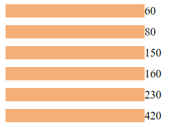
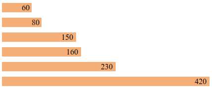
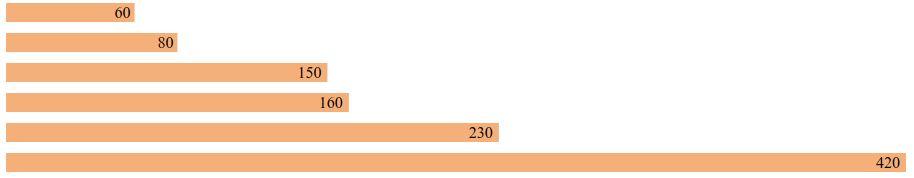
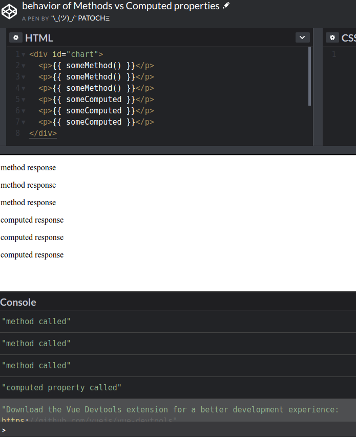

author:            Patrick Merlot
summary:           Basic Visualization with Vue.JS
id:                basic-visualization-with-VueJS
categories:        education,webapp,VueJS,data,visualization,SVG
environments:      Codelabs
status:            draft
feedback link:     github.com/Patechoc/codelabs
analytics account: UA-72074624-2

# Basic Visualization with VueJS

## Overview of the tutorial
Duration: 5:00

[VueJS](https://vuejs.org/) is one of the 3 most used modern web development framework together with [React](https://reactjs.org) and [Angular](https://angular.io).

Despite that the latter maintained respectively by the tech giants _Facebook_ and _Google_, Vue seems highly attractive to many experienced web developers for its design, its flexibility and ease of development. That makes it very appealing for a newbie like me who doesn't know where to start ;)

This tutorial is about **visualizing data in a web app built with Vue.JS**. It is the codelab version of a useful presentation by Callum Macrae, ["Data visualisation with Vue.JS"](https://www.youtube.com/watch?v=30v9xnB-GEo).

### What you will learn

In this tutorial you will learn to do the following:

* write Hello World with Vue.js
* draw a rectangle as vector graphics (building SVG objects)
* define the properties of this SVG object in Vue.js
* use Vue transforms to replicate multiple rectangles 
* inject some javascript to build a bar chart with Vue.js and your simple SVG.
* introduce methods in Vue.js to keep the logic out of the HTML as much as possible.

### Prerequisites

Negative
: we assume you know how to build a new project with VueJS. Even thought this codelabs makes heavy use of [Codepen](https://codepen.io/) to test your code snippets, it is expected that you can run the same example locally as well.
So If you haven't already, follow this tutorial which teaches you how to [build your first empty app with Vue](../building-your-first-webapp-with-VueJS).


## Let's write Hello World


With this [codepen using only HTML & JS](https://codepen.io/patechoc/pen/OrwapX) piece of code:

```html
<!-- development version, includes helpful console warnings -->
<script src="https://cdn.jsdelivr.net/npm/vue/dist/vue.js"></script>

<div id="app">
  {{ message }}
</div>
```

```javascript
var app = new Vue({
  el: '#app',
  data: {
    message: 'Hello Vue!'
  }
})
```
you should see:

```html
Hello Vue!
```

## Now let's draw a vectorized rectangle


```html
<svg xmlns="http://www.w3.org/2000/svg"
      width="200" height="200">
  
   <rect width="200" height="100"
        x="10" y="10"
        fill="#f0b375">
  </rect>
</svg>
```

Simply test it live: [https://codepen.io/patechoc/pen/PXyerE](https://codepen.io/patechoc/pen/PXyerE).

## binding SVG and Vue

Let's get back the width and height from Javascript with Vue:


```javascript
new Vue({
  el: '#chart',
  data: {
    width: 200,
    height: 100,
    x: 10,
    y: 10
  }
});
```

```html
  <svg xmlns="http://www.w3.org/2000/svg"
        width="200" height="200" id="chart">

     <rect :width="width" :height="height"
          :x="x" :y="y"
          fill="#f0b375">
    </rect>
    
  </svg>
```

You should get the exact same rectangle, but now generated from values coming from Vue.

## Build a bar chart in 15 lines

Start building a bar chart now!

We introduce the `<g>` element in SVG, which is a bit like the `<div>` in HTML. It doesn't do anything by itself, but you use it to group things together, here a rectangle and some text.


```html
<svg xmlns="http://www.w3.org/2000/svg" width="500" height="300">
  <g transform="translate(0,0)">
    <rect width="60" height="19" fill="#f0b375"></rect>
    <text x="60" y="9.5" dy=".35em">60</text>
  </g>
  <g transform="translate(0,20)">
    <rect width="80" height="19" fill="#f0b375"></rect>
    <text x="80" y="9.5" dy=".35em">80</text>
  </g>
  <g transform="translate(0,40)">
    <rect width="150" height="19" fill="#f0b375"></rect>
    <text x="150" y="9.5" dy=".35em">150</text>
  </g>
  <g transform="translate(0,60)">
    <rect width="160" height="19" fill="#f0b375"></rect>
    <text x="160" y="9.5" dy=".35em">160</text>
  </g>
  <g transform="translate(0,80)">
    <rect width="230" height="19" fill="#f0b375"></rect>
    <text x="230" y="9.5" dy=".35em">230</text>
  </g>
  <g transform="translate(0,100)">
    <rect width="420" height="19" fill="#f0b375"></rect>
    <text x="420" y="9.5" dy=".35em">420</text>
  </g>
</svg>
```

Clearly a _For loop_ would be more elegant here and reduce the size of the HTML template.


```javascript
new Vue({
  el: '#chart',
  data: {
    chartData: [60, 80, 150, 160, 230, 420],
  },
});
```


```html
<svg xmlns="http://www.w3.org/2000/svg" width="500" height="300" id="chart">
  <g
    v-for="(value, i) in chartData"
    :transform="`translate(0, ${i * 30})`">
    <rect width=200 height="19" fill="#f0b375"></rect>
    <text x="200" y="9.5" dy=".35em">{{ value }}</text>
  </g>
</svg>
```

This will simply translate the same rectangle (200x19) by 30 pixels to make [this](https://codepen.io/patechoc/pen/REeYeK):

[](https://codepen.io/patechoc/pen/REeYeK)


And to get a bar chart, we just need to pass the value to the width of each rectangle.
The javascript part doesn't change.

```javascript
new Vue({
  el: '#chart',
  data: {
    chartData: [60, 80, 150, 160, 230, 420],
  },
});
```


But to generate the length of these bars, we will include some javascript and do a little bit of maths. Thos [codepen](https://codepen.io/patechoc/pen/jXeJEP) will show it live.

[](https://codepen.io/patechoc/pen/jXeJEP)

```html
<svg xmlns="http://www.w3.org/2000/svg" width="500" height="300" id="chart">
  <g
    v-for="(value, i) in chartData"
    :transform="`translate(0, ${i * 30})`">
    <rect :width="value" height="19" fill="#f0b375"></rect>
    <text :x="value" :dx="-Math.ceil(Math.log10(value))*10" y="9.5" dy=".35em">{{ value }}</text>
  </g>
</svg>
```

The problem with that is that it moves maybe too much of the logic to the HTML template. We would rather compute everything in the Javascript.


## Extending the Vue object with methods

Here we move the calculation of the length of the bar and of the position of the text from the HTML template back to javascript with the Vue.js methods `barWidth(value)` and `textPosition(value)`. This doesn't change [the output](https://codepen.io/patechoc/pen/xmyBoQ).


```javascript
new Vue({
  el: '#chart',
  data: {
    chartData: [60, 80, 150, 160, 230, 420],
  },
  methods: {
    barWidth(value){
      return value*500/420;
    },
    textPosition(value){
      return -Math.ceil(Math.log10(value))*10;
    },
  },
});
```


```html
<svg xmlns="http://www.w3.org/2000/svg" width="500" height="300" id="chart">
  <g
    v-for="(value, i) in chartData"
    :transform="`translate(0, ${i * 30})`">
    <rect :width="barWidth(value)" height="19" fill="#f0b375"></rect>
    <text :x="barWidth(value)" :dx="textPosition(value)" y="9.5" dy=".35em">{{ value }}</text>
  </g>
</svg>
```

Notice that now, we also scale the bars relatively to the highest value we have (here `420`). The length of the highest bar should always be at the max of your SVG width (e.g. `500`), and the others be scaled relatively to that one (i.e. multiplied by a factor `500/420`).

## Extending the Vue object with computed properties

We hard-coded the scaling factor `500/420` in the last example. This is not so elegant ;)

Hopefully for us, Vue.js also includes what is called **computed properties**.

We don't have to change the HTML template (a little bit here to update the SVG length and width),

```html
<svg xmlns="http://www.w3.org/2000/svg" :width="chartWidth" :height="chartLength" id="chart">
  <g
    v-for="(value, i) in chartData"
    :transform="`translate(0, ${i * 30})`">
    <rect :width="barWidth(value)" height="19" fill="#f0b375"></rect>
    <text :x="barWidth(value)" :dx="textPosition(value)" y="9.5" dy=".35em">{{ value }}</text>
  </g>
</svg>
```


and here is how we use the computed properties in javascript:

```javascript
new Vue({
  el: '#chart',
  data: {
    chartWidth: 600,
    chartLength: 300,
    chartData: [60, 80, 150, 160, 230, 420],
  },
  methods: {
    barWidth(value){
      return value * this.chartWidth / this.dataMax;
    },
    textPosition(value){
      return -Math.ceil(Math.log10(value))*10;
    },
  },
  computed: {
    dataMax() {
      return Math.max(...this.chartData);
    },
  },
});
```
[](https://codepen.io/patechoc/pen/QzZPMa)

See it working [live here](https://codepen.io/patechoc/pen/QzZPMa) and play with the values in the JS part.


**Computed properties** are like half-way between the **data** and the **methods**:
* we access them as if they were properties of the data object,
* but they are executed as functions.


## Vue.js methods & computed properties behaves differently

### Similar functionalities

Let's compare Vue.js methods and computed properties:

```html
<div id="chart">
  <p>{{ someMethod() }}</p>
  <p>{{ someComputed }}</p>
</div>
```

```javascript
new Vue({
  el: '#chart',
  methods: {
    someMethod() {
      return "method response";
    },
  },
  computed: {
    someComputed() {
      return "computed response";
    },
  },
});
```

Test it live [here](https://codepen.io/patechoc/pen/mazYdM)!

### Different behaviour

Even though they look very similar, they behave very differently.

We can desmonstrate it by calling them multiple times and adding some logs to the console:

```html
<div id="chart">
  <p>{{ someMethod() }}</p>
  <p>{{ someMethod() }}</p>
  <p>{{ someMethod() }}</p>
  <p>{{ someComputed }}</p>
  <p>{{ someComputed }}</p>
  <p>{{ someComputed }}</p>
</div>
```

```javascript
new Vue({
  el: '#chart',
  methods: {
    someMethod() {
      console.log("method called");
      return "method response";
    },
  },
  computed: {
    someComputed() {
      console.log("computed property called");
      return "computed response";
    },
  },
});
```



The output looks like each has been called 3 times, but the console clearly shows that only the method has really been processed/evaluated 3 times, while the value of computed property seems like cached and not evaluated more than once!

See it by yourself in this [code snippet](https://codepen.io/patechoc/pen/OrBeJG)!


## Events in Vue.js

Events use the [`v-on`](https://vuejs.org/v2/guide/syntax.html#v-on-Shorthand) directive.
And if you want more on [directives](https://vuejs.org/v2/guide/syntax.html#Directives)...

* If we pass `click` to `v-on` as an argument.
* when we click anywhere on the SVG chart, we trigger the `handleClick` method.
* In this example the `handleClick` method just randomize the input data.


```html
<svg id="chart" :width="chartWidth" :height="chartHeight" v-on:click="handleClick">
  <g
     v-for="(value, i) in chartData"
     :transform="`translate(0, ${i * (barHeight + 10)})`">
    <rect :height="barHeight" :width="barWidth(value)"></rect>
    <text :y="barHeight / 2" :x="barWidth(value) - 10">{{ value }}</text>
  </g>
</svg>

<!-- intro next part + hardcode dataMax -->
```

```javascript
const randomData = () => new Array(6).fill('').map(() => 1 + Math.floor(Math.random() * 20));

new Vue({
  el: '#chart',
  data: {
    chartWidth: 900,
    chartHeight: window.innerHeight - 10,
    chartData: [60, 80, 150, 160, 230, 420],
  },
  methods: {
    barWidth(value){
      return value * this.chartWidth / this.dataMax;
    },
    textPosition(value){
      return -Math.ceil(Math.log10(value))*10;
    },
    handleClick() {
      this.chartData = randomData();
    },
  },
  computed: {
    barHeight() {
      return this.chartHeight / this.chartData.length - 10;
    },
    dataMax() {
      return Math.max(...this.chartData);
    },
  },
});

```

Click on the SVG in this [live snippet](https://codepen.io/patechoc/pen/mazZod)!


https://www.youtube.com/watch?v=30v9xnB-GEo
http://macr.ae/


## References

* [https://vuejs.org/v2/guide/](https://vuejs.org/v2/guide/)
* [Screencasts mirroring the official Vue.js guide](https://scrimba.com/playlist/pXKqta)
* Example: SVG transforms (translation, rotation, skew, scale, matrix, 3D rendering) https://codepen.io/AmeliaBR/pen/aDhrs/
* Example: interactions with widgets using HTML, SCSS (CSS) and Babel (JS) https://codepen.io/airen/pen/LerXYd
* Example using Pug (HTML), Less (CSS) and Babel (JS): https://codepen.io/sirlancelot/pen/NNGYEP
* Example using Pug (HTML), Less (CSS) and Babel (JS): https://codepen.io/sirlancelot/pen/ZWEWbQ
* Many examples with demo: https://vuejsexamples.com/font-awesome-component-for-vue-js-using-inline-svg/
* Art with SVG: (Mathieu Robert Ortis style) https://codepen.io/igstudio/pen/ZQxrBw, the eye https://codepen.io/ge1doot/pen/qLyZvQ
* Maps **[TO BE ADAPTED TO Vue.js]**: https://gist.github.com/auremoser/da1b8fe8de23fe6365923b1a4d8f7b7d